# css渲染及动画深入理解
## 网页的分层机制
> 一个网页是由多个层展示的，然后再将这些层合并层一个层，当dom或样式变化时，GPU(显卡)能够缓存一些不变的内容(层),将要变化的层与缓存层再合成，提高渲染效率，因此在做动画时让GPU参与进来，提高动画性能
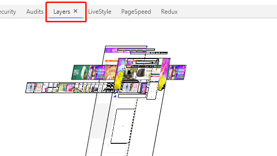
### Layer模型
> - 浏览器根据CSS属性为元素生成Layers
> - 将Layers作为位图上传到GPU
> - 当改变Layer的transform，opcity等属性时，渲染会跳过Layout，paint，直接通知GPU对Layer做变换

```
Layer创建标准
根元素、拥有3dtransform属性、使用animation,transition实现 opacity，transform的动画
position、transform、半透明、CSS滤镜fitters、Canvas2D、video、溢出，Flash，
z-index大于某个相邻节点的Layer的元素
```
## HTML的渲染机制
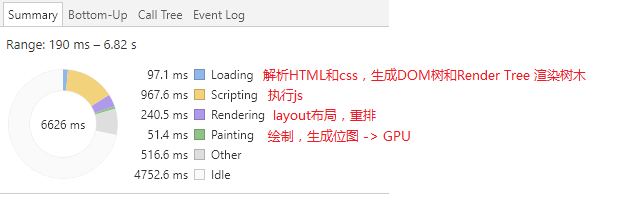
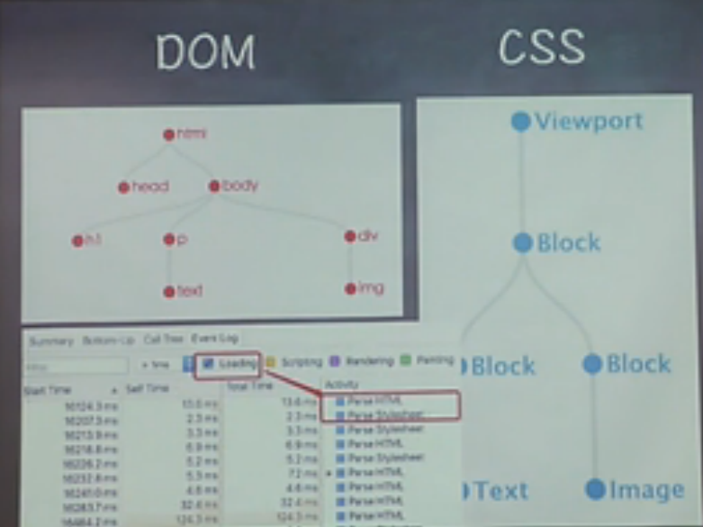
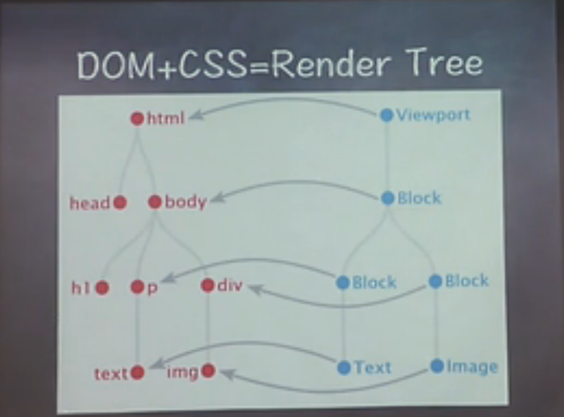
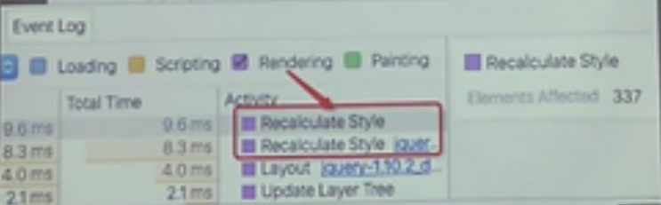
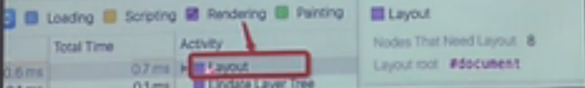
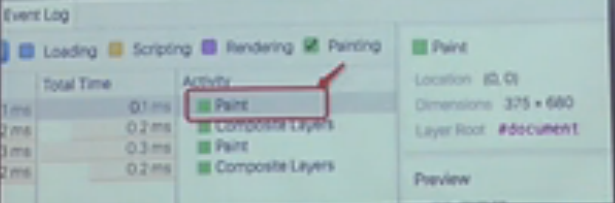
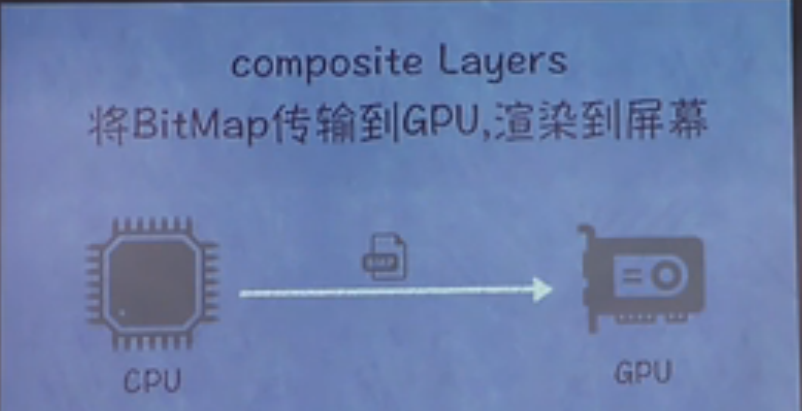

### 1.webkit渲染html+css
1-1.获取DOM 分割层
1-2.计算CSS样式
1-3.重排，放置dom的位置(layout)
1-4.节点填充 重绘(paint)
1-5.GPU生成纹理展现到页面(元素偏移、缩放)
1-6.GPU参与网页合成层(compsite) => 屏幕最终图像
【DOM子树渲染层(RenderLayer) -> RenderObject(元素) -> GraphicsContext】
【Compositor -> 渲染层子树的图形层(GraphicsLayer) -> RenderLayer -> RenderObject】
【Compositor将所有的拥有compositing layer 进行合成，合成过程GPU进行参与。
合成完毕能够将纹理映射到一个网格几何机构之上，纹理能够以很低代价映射到不同的位置，而且还能够以很低的代价通过把他们应用到一个非常简单的矩形网格中进行变形，这就是 3D CSS 实现原理。】
【GPU参与: CSS3D、webgel、transform、硬件加速】
【硬件加速：
  ①.Texture,即CPU传输到GPU的一个BitMap位图
  ②GPU能快速对Texture进行偏移、缩放、旋转、修改透明度等操作
开启硬件加速，让动画元素独立创建一个层，例如transform:translateZ(0)
】
【Composite:GPU也是有限度的，不要滥用GPU资源生成不必要的Layer，留意意外生成的Layer】
**总结: 浏览器渲染: Load、Layout、Paint、Composite Layers**
**修改不同的CSS属性会触发不同阶段**
**触发的阶段越前，渲染的代价越高**

### 2.网页就像搭积木：一旦积木位置移动-重排，上色-重绘
2.1.网页生成时，至少会渲染一次，用户访问过程中，还会不断重新渲染(修改DOM、修改样式表、用户事件)
2.2.重绘不一定引起重排，但重排一定会引起重绘
2.3.重排: 页面初始化、引起的盒子变化
> - 添加或者删除可见的DOM元素
> - 元素位置改变
> - 元素尺寸改变
> - 元素内容改变（例如：一个文本被另一个不同尺寸的图片替代）
> - 页面渲染初始化（无法避免）
> - 浏览器窗口尺寸改变
> - 读取CSS相关属性也会触发重排
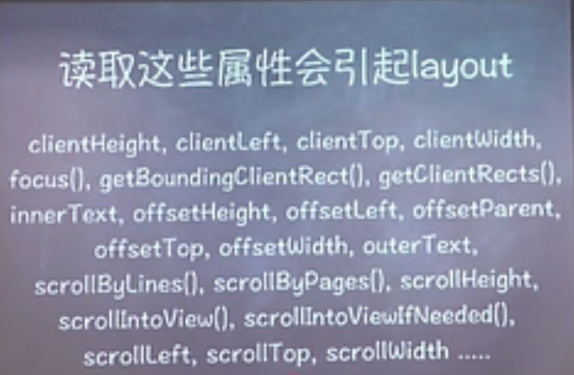

2.3.1 尽量不触发Layout
> - 使用transform代替top，left的动画

2.4.重绘：外观改变
> - 当修改border-radius,box-shadow,color,backgroud等展示相关属性时候,会触发重绘
> - 在经常paint的区域，要避免代价太高style
> - 不要用gif图，或者在不需要时，display:none，
> - 减少绘制区域，为引起大范围Paint的元素生成独立的Layer(比如将动画部分设置position:absolute)

####  深层次理解重排与重绘
浏览器执行线程: 主线程 和 排版线程
1.主线程: 通常情况下，主线程主要负责以下工作：运行JavaScript、计算HTML元素的CSS样式、布局页面、把页面元素绘制成一个或多个位图、把这些位图移交给排版线程
2.排版线程: 通过GPU把位图绘制到了屏幕上
3.重排与重绘
浏览器下载完页面中的所有资源(html、js、css、图片) -> 解析成 DOM树和渲染树
* DOM树表示页面结构，渲染树表示DOM节点如何显示
* DOM树中的每一个需要显示的节点在渲染树种至少存在一个对应的节点（隐藏的DOM元素 disply值为none 在渲染树中没有对应的节点）
* 渲染树中的节点被称为“帧”或“盒”,符合CSS模型的定义，理解页面元素为一个具有填充，边距，边框和位置的盒子
* 一旦 DOM和渲染树构建完成，浏览器就开始显示（绘制）页面元素
* 当DOM的变化影响了元素的几何属性（宽或高），浏览器需要重新计算元素的几何属性，同样其他元素的几何属性和位置也会因此受到影响。浏览器会使渲染树中受到影响的部分失效，并重新构造渲染树。这个过程称为重排。
* 完成重排后，浏览器会重新绘制受影响的部分到屏幕，该过程称为重绘

### 3.浏览器会把要引起重绘与重排的操作都塞到主线程队列里面，正准备执行优化后队列的时候，如果你做了一个读取width的操作，浏览器会全部放弃之前的优化，造成性能急剧下降

#### 方案一 :面对别人写好的代码，使用requestAnimationFrame 推迟到下一帧执行
```
//Bad Code - 别人写好的代码
el1.addEventListener('click', function(){
    var h1 = el1.clientHeight; 
    el1.style.height = (h1 * 2) + 'px';
});
el2.addEventListener('click', function(){
    var h2 = el2.clientHeight; 
    el2.style.height = (h2 * 2) + 'px';
});
//Good Code - 我做的优化代码
el1.addEventListener('click', function(){
    //Read
    var h1 = el1.clientHeight;
    //Write 推迟到下一帧再执行
    requestAnimationFrame(function(){
       el1.style.height = (h1 * 2) + 'px';
    });
});
el2.addEventListener('click', function(){
    var h2 = el2.clientHeight; 
    requestAnimationFrame(function(){
       el2.style.height = (h2 * 2) + 'px';
    });
});
---------------------------------------------------
requestAnimationFrame(function(){
    $('#test').width();
})
```
#### 方案二: 分离读写，减少Layout
> - 在每一帧先做批量的读操作，再批量运行写操作
> - fastdom.js
3.1.使用读写分类的策略来优化

### 4.不要以为单独的层是万能的，单独层内部的元素触发重排、重绘的条件，一样会只重排、重绘这一层

### 5.CPU VS GPU
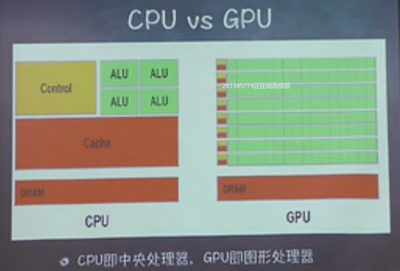
> - ALU 面积越大，计算能力越强，
> - ALU计算单元越多，吞吐量就越大

相同: 两者都有总线和外界联系，有自己的缓存体系，以及运算单元，两者都为了完成计算而生
不同: CPU主要负责操作系统和应用程序的逻辑运算，GPU处理显示相关的数据处理
**GPU运算更快，GPU的活CPU一般都能干，但是效率低下**

### 6.Timeline或Performance 检测动画性能
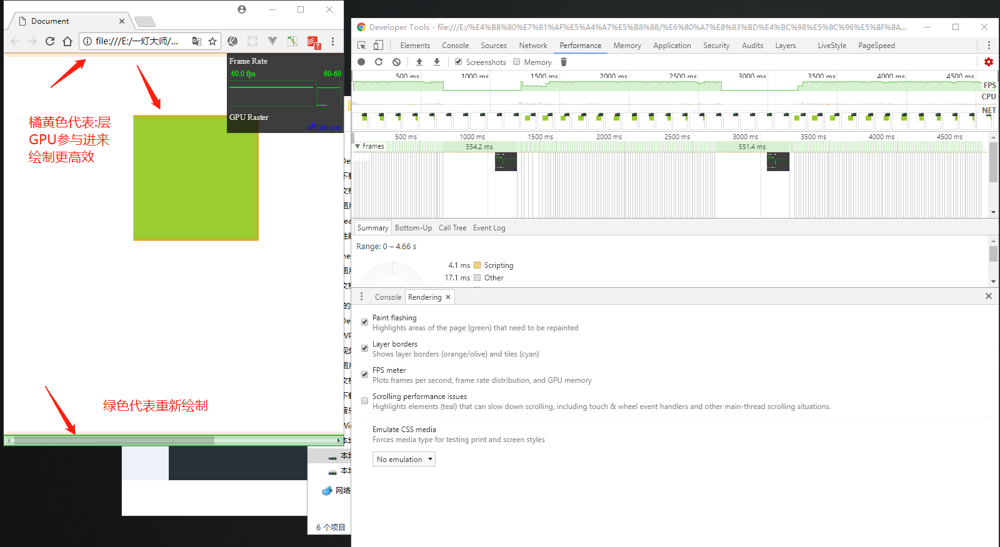
#### 对比一下两个动画
```
//1.不使用transform:引起重排和重绘
@keyframes run-around{
    0%{top: 0;left: 0;}
    25%{top: 0;left: 200px;}
    50%{top: 200px;left: 200px;}
    75%{top: 200px;left: 0;}
    100%{top: 0;left: 0;}
}
//2.使用transform:不引起重排和重绘
@keyframes run-around{
    0%{transform: translate(0,0);}
    25%{transform: translate(200px,0);}
    50%{transform: translate(200px,200px);}
    75%{transform: translate(0,200px);}
    100%{transform: translate(0,0);}
}
//3.矩阵动画: 更高效
@keyframes run-around{
    0%{transform: matrix(1, 0, 0, 1, 0, 0);}     
    25%{transform: matrix(1, 0, 0, 1, 200, 0);}  
    50%{transform: matrix(1, 0, 0, 1, 200, 200);}
    75%{transform: matrix(1, 0, 0, 1, 0, 200);}  
    100%{transform: matrix(1, 0, 0, 1, 0, 0);}
}
```
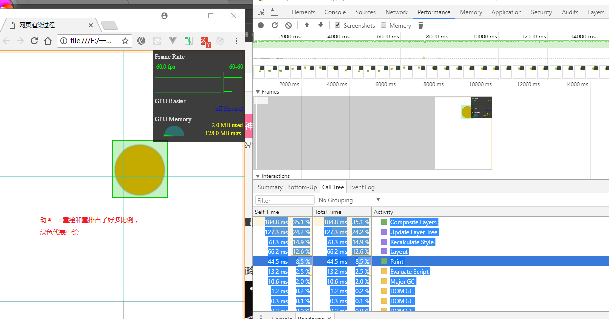
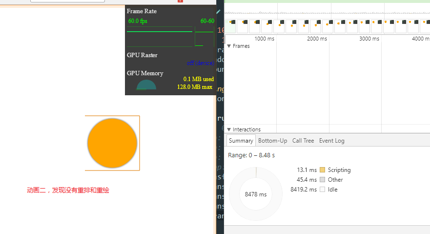
> - 1.在整个动画的每一帧中，浏览器都要去重新布局，绘制页面，并把最新的位图对象加载到GPU
> - 2.根据定义，CSS的transform属性不会改变元素的布局，也不会影响到其周围的元素。它把元素当做一个整体看待——缩放整个元素、旋转整个元素或者移动整个元素。
浏览器只需在动画开始的时候生成这个元素的位图对象，并把它传递给GPU。在这之后，浏览器无需再做任何重新布局，绘制页面以及传递位图对象的操作了，相反，浏览器可以利用GPU擅长的绘制的特点来快速的在不同的位置，旋转或缩放同一个位图对象

**transform: 节省了CPU进行Layout、Paint的时间((跳过)，节省了CPU向GPU传输位图的时间**

## 完美的Animation
> - 15FPS 有卡顿
> - 30FPS 感觉流畅
> - 60FPS 更舒服完美
> - 60FPS: 1s/60FPS = 16.7ms 表示1秒钟完成的60帧, 16.7ms/FPS (16.7毫秒，就要把一帧准备好)

###两个问题
> - 开始绘制的时机
> - 绘制一帧的时间(16.7ms最完美)
#### setTimeout（放弃吧）
1.setTimeout不够精确，它依靠浏览器内置时钟更新频率，不同浏览器更新频率不同
> - setTimeout(fn, 1/60);
> - IE8及以前更新间隔为15.6ms，setTimeout 16.7需要两个15.6ms才触发，超过14.5ms就会丢帧

2.setTimeout的回调会加入到异步队列，需要等到主队列执行完，才会执行异步队列
#### requestAnimation
> - 定义绘制每一帧前的准备工作 requestAnimation(callback);
> - 自动调节频率，callback工作太多无法在一帧内完成，会自动降低为30FPS，虽然频率降低但比丢帧好

## 总结重绘


**学习参考网址:http://jankfree.org/**