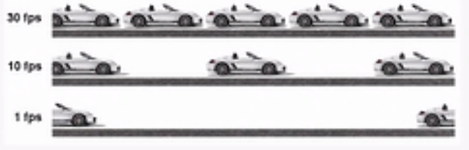
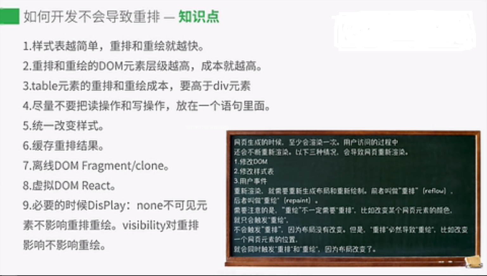

# TimeLine 帧渲染模式
## 简介
> - 网页动画能做到每秒60帧，就会跟显示器同步刷新，一秒之内进行60次重新渲染，每次重新渲染时间不能超过16.66ms
> - 蓝色: 网络通信和HTML解析
> - 黄色: Javascript执行
> - 紫色: 样式计算和布局，即重排
> - 绿色: 重绘
> - window.requestAnimationFrame() 下一次
> - window.requestldleCallback() 下几次重新渲染时

```
$(window).on('scroll', function(){
    window.requestAnimationFrame(scrollHandler); 
});
```
## 触发分层
> - 获取DOM并将其分割为多个层
> - 将每个层独立的绘制进行位图中
> - 将层作为纹理上传至GPU(显卡)
> - 复合多个层来生成最终的屏幕图像


## 重排
