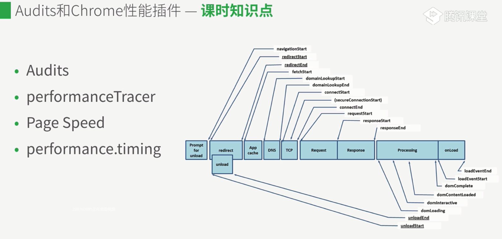
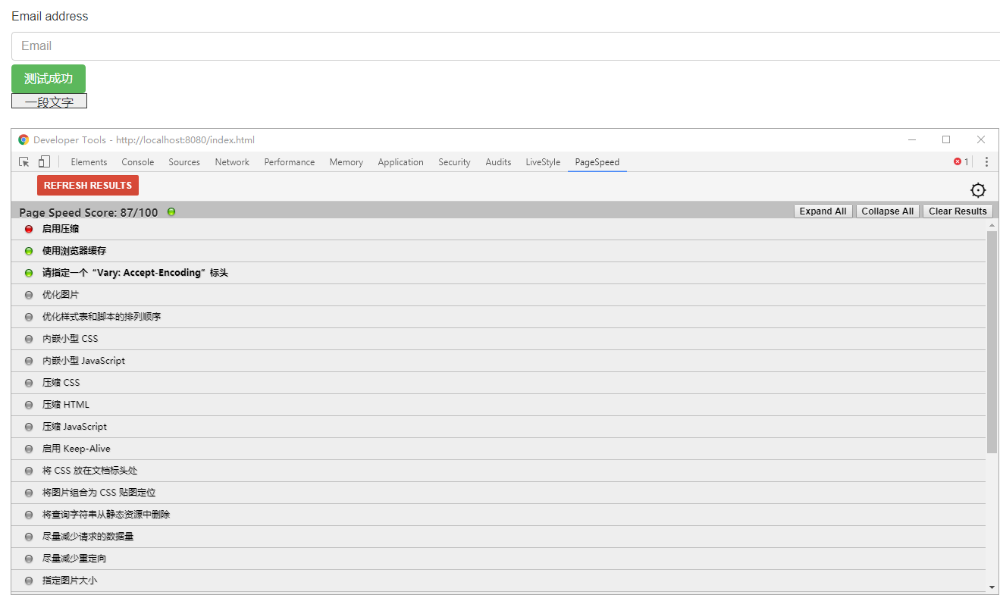

# chrome性能面板使用
**监控性能:在发布状态下使用**



## performance.timing API使用
> 创建性能监控平台
```
connectEnd:1519716227157
connectStart:1519716227157
domComplete:1519716227891
domContentLoadedEventEnd:1519716227741
domContentLoadedEventStart:1519716227740
domInteractive:1519716227740
domLoading:1519716227578
domainLookupEnd:1519716227157
domainLookupStart:1519716227157
fetchStart:1519716227157
loadEventEnd:1519716227891
loadEventStart:1519716227891
navigationStart:1519716227150
redirectEnd:0
redirectStart:0
requestStart:1519716227159
responseEnd:1519716227577
responseStart:1519716227159
secureConnectionStart:0
unloadEventEnd:0
unloadEventStart:0
```
```
主要性能分析指标
DNS查询耗时 = domainLookupEnd - domainLookupStart
TCP链接耗时 = connectEnd - connectStart
request请求耗时 = responseEnd - responseStart
解析dom树耗时 = domComplete - domInteractive
白屏时间 = domloadng - fetchStart
domready时间 = domContentLoadedEventEnd - fetchStart
onload时间 = loadEventEnd - fetchStart
```
```
实际前端更关注的指标（需要在实际中结合自身代码）：
console.log('首屏图片加载完成 : ',window.lastImgLoadTime - window.performance.timing.navigationStart); //在最后一张图出来的时候打时间点
console.log('HTML加载完成 : ',window.loadHtmlTime - window.performance.timing.navigationStart);//在HTML后打时间点
console.log('首屏接口完成加载完成 : ',Report.SPEED.MAINCGI - window.performance.timing.navigationStart);//在首屏的接口打时间点
console.log('接口完成加载完成 : ',Report.SPEED.LASTCGI - window.performance.timing.navigationStart);//在所有接口打时间点
```